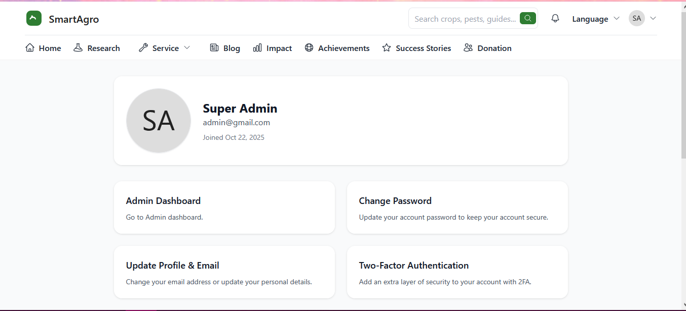
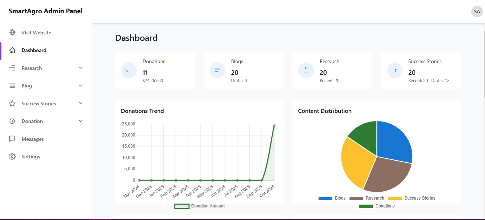
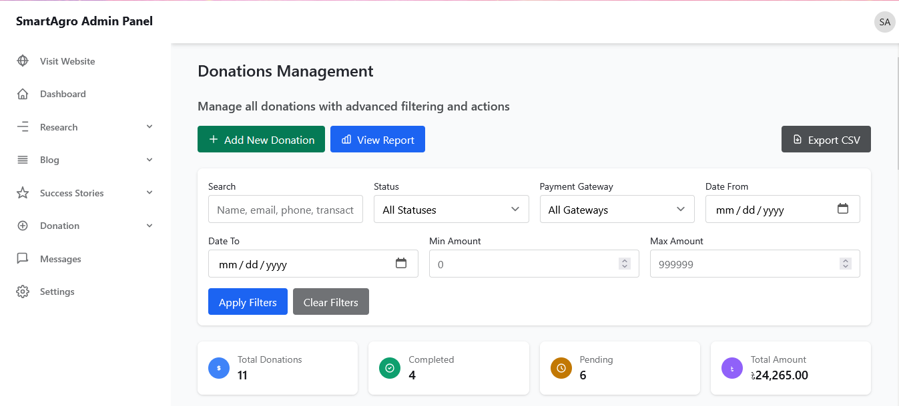
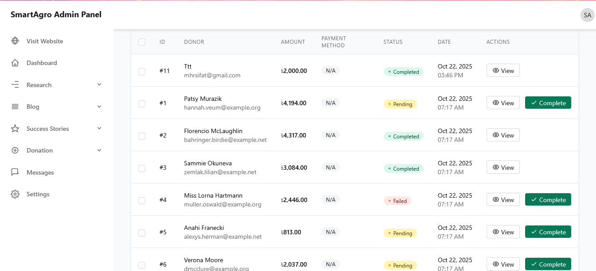
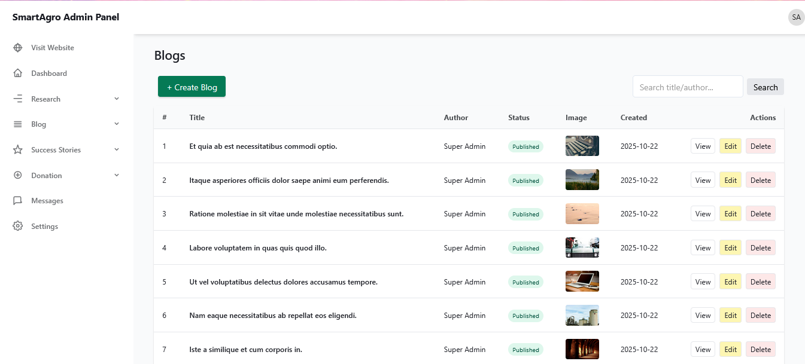
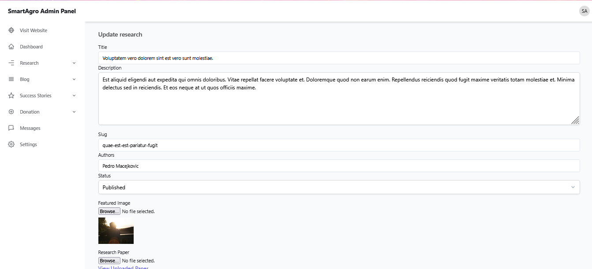
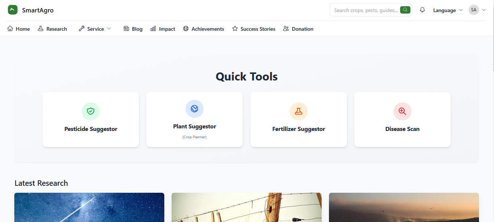
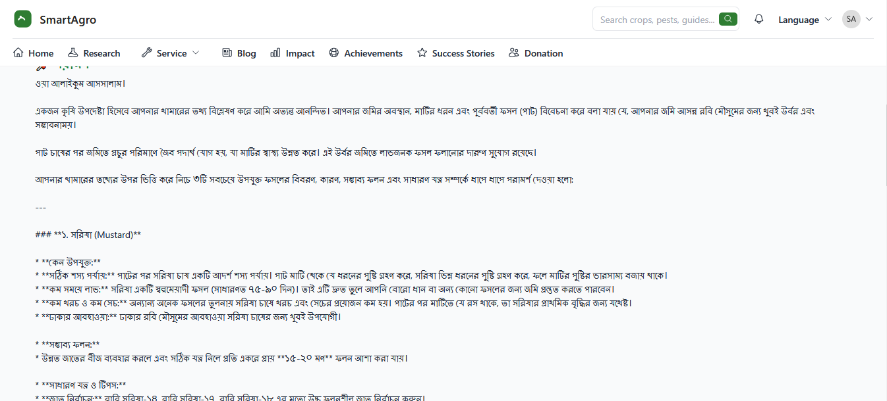
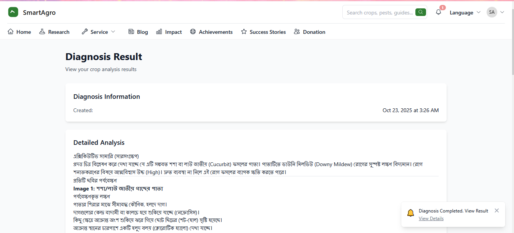
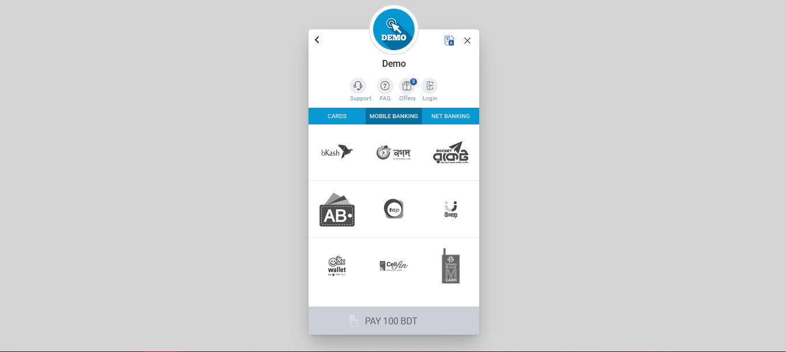

# 🌱 SmartAgro
AI-powered agro advisory platform offering crop, fertilizer, pesticide and disease suggestions 

### Live Demo
https://smartagro.mhrsifat.xyz/

---

## 🧠 Overview
SmartAgro is an AI-driven agricultural advisory platform designed to help farmers and agronomists make data-driven *(bn: data-driven = তথ্যনির্ভর)* decisions. Core modules include:

- **Crop Planner / Plant Suggestion**
- **Fertilizer Suggestor**
- **Pesticide Suggestor**
- **Disease Scan (image based)**

The platform includes research articles, impact stories, success workflows, and multilingual UI (English, বাংলা, العربية).  
The backend is optimized for modest *(bn: modest = স্বল্প ক্ষমতাসম্পন্ন)* infrastructure environments.

---

## 🖼️ Featured Screens
| Screenshot | Description |
|-----------|-------------|






















---

## 🎯 Core Tools
- Crop Planner (plant suggestion based on soil & region)
- Fertilizer recommendation engine
- Pesticide compatibility suggestion
- Disease analysis from uploaded images
- Research‐backed articles & case studies *(bn: case studies = কেস ভিত্তিক বিশ্লেষণ)*

---

## 🧩 Key Features
- ⚡ Quick actionable tools
- 🌍 Multilingual (English / বাংলা / العربية)
- 📦 Docker-ready deployment
- 📚 Research content & impact stories included
- 🎛️ Lightweight backend footprint *(bn: footprint = সম্পদ ব্যবহার)*

---

## 🔧 Tech Stack
- Laravel (PHP)
- Blade Templates
- Tailwind CSS
- MariaDB
- Docker
- Optional: Alpine.js, MUI, Bootstrap utilities *(bn: utilities = সহায়ক টুল)*

---

## 🏗️ Architecture Notes *(optional)*
- Modular suggestion engines (fertilizer, pesticide, disease)
- Extensible *(bn: extensible = সহজে বর্ধিতযোগ্য)* model layer
- Image inference pipeline stubbed for external ML integration

---

## 🚀 Local Setup

```bash
# Clone
git clone https://github.com/mhrsifat/smartAgro.git
cd smartAgro

# Environment
cp .env.example .env
php artisan key:generate

# Backend
composer install

# Frontend
npm install
npm run dev

# Database
php artisan migrate --seed


# Docker
docker compose up --build


# Serve
php artisan serve
